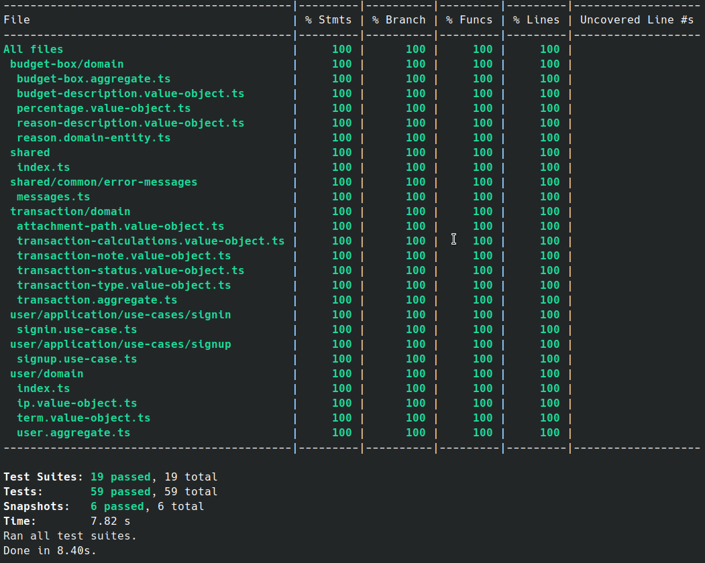
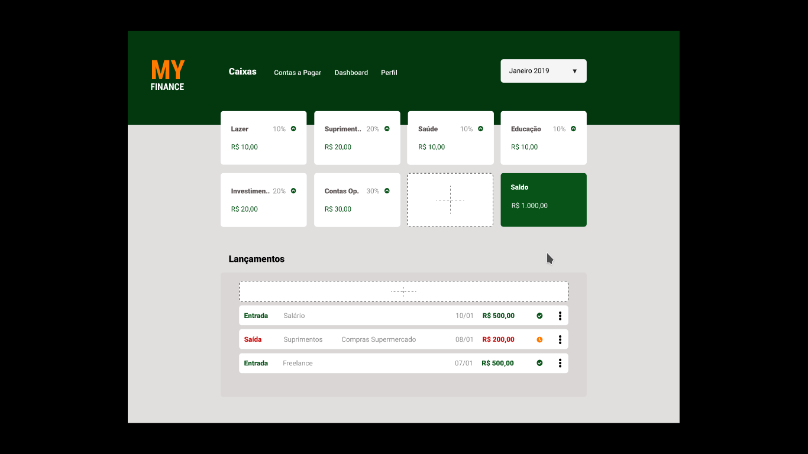
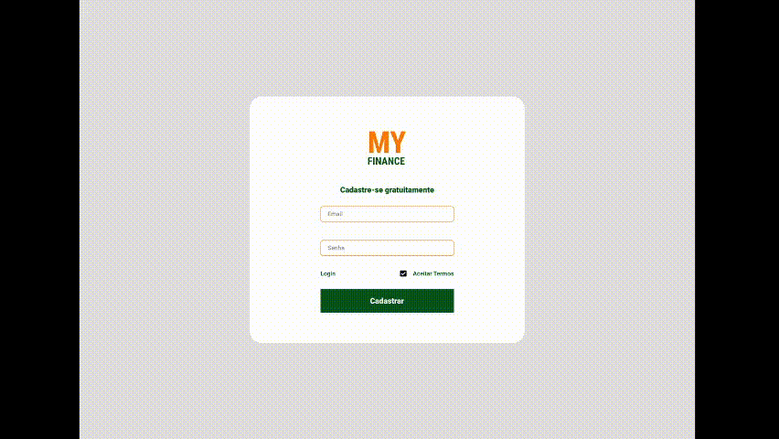
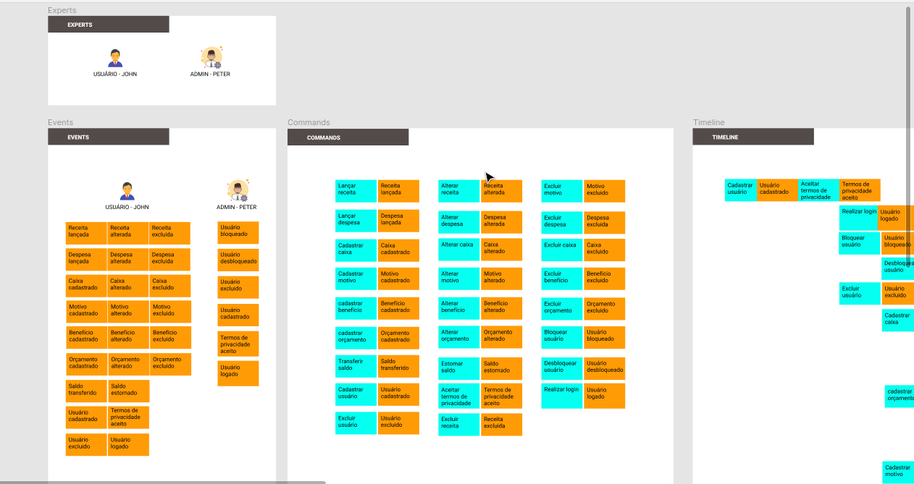
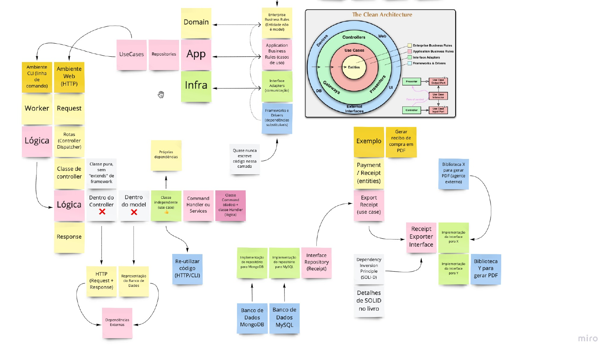

# API - Controle Financeiro

## Um projeto aplicando os principais conceitos de DDD

Neste projeto financeiro para controle de finanças foi aplicado domain-driven-design

### Documentação da Api

Disponível [no link](https://finance-api-ddd.herokuapp.com/doc)

### Como rodar esse projeto

Para rodar o projeto local em sua máquina utilizando docker

- Realize o clone deste projeto para sua máquina.

```sh
 
 $ git clone https://github.com/4lessandrodev/finance-project-ddd.git

```

- Crie seu arquivo `.env` utilizando como exemplo o arquivo `.env.example`

- Execute o docker

```sh
 
 $ docker-compose up -d

```

- Instale as dependências 

```sh
 
 $ yarn

```

- Execute o projeto 

```sh
 
 $ yarn start:dev

```

- Acesse a api em `http://localhost:3000/graphql`


### Rodar os testes

```sh
 
 $ yarn test

```

### Cobertura de tests



### Requisitos

Preciso de um sistema que gerencie minhas finanças.
Entradas e Saídas de capital.

    Eu faço a contabilidade de minhas finanças da seguinte forma:
    Em uma planilha do excel tenho o controle de entradas e saídas de capital.
    Se é um recebimento de capital eu lanço como receita.
    Se é um pagamento de qualquer tipo de dívida eu lanço como despesa.

    Obs: Eu recebo alguns benefícios que também são contabilizados como receita,
    no entanto são subcategorizados como benefício.
    Exemplo: Vale Alimentação, Vale Transporte e Vale Refeição

    Anualmente eu faço um orçamento de custos onde defino uma meta em percentual
    para cada caixa financeiro (Categoria de custo). Assim fica definido como será
    dividida todas as receitas,
    Exemplo:

    No ano atual tenho o seguinte orçamento:
    Lazer: 10% das receitas
    Educação: 10% das receitas
    Suprimentos: 20% das receitas
    Vestuário: 10% das receitas
    Investimentos: 20% das receitas
    Saúde: 10% das receitas
    Contas Operacionais: 20% das receitas

    Quando realizo o lançamento de uma receita que não é subcategorizado como
    benefício o percentual é dividido de acordo com o percentual da meta de cada caixa
    e é contatilizado como saldo para cada qual.

    Quando o lançamento é de um benefício, o saldo é lançado 100% para o mesmo.

    Benefícios:
    Vale Alimentação
    Vale Refeição
    Vale Transporte

    Contabilização de uma despesa.
    A despesa é mais simples, pois é contabilizado uma saida para o caixa escolhido,
    Exemplo:

    Lançamento: Despesa, Caixa: Educação, Valor: 10,00
    Automaticamente é debitado do saldo deste caixa.


    Requisitos extras:
    Como usuário quero poder colocar observação opcional em cada lançamento.
    Como usuário quero poder anexar um comprovante opcionalmente.
    Como usuário quero poder criar ou modificar os caixas (orçamento) a qualquer momento.
    Como usuário quero poder excluir um lançamento a qualquer momento.
    Como usuário quero poder transferir um saldo de um caixa para outro.
    Como usuário eu quero poder identificar de maneira clara o saldo em cada caixa e o saldo total.

### Linguagem Ubíqua

- **Budget-Box:** São caixas financeiros, cada qual com seu objetivo. 
Exemplo Caixa Financeiro de Educação, destinado a receber um percentual de receita que será investido em cursos, livros ou afins relacionado a educação.

- **Income:** Entrada, Receita, valor monetário recebido, entrada de capital.

- **Expenses:** Saída, Despesa, valor monetário pago, saída de capital.

- **Transaction-Calculation:** Cálculo de um lançamento, seja entrada ou saída.
Exemplo, todo lançamento de receita tem seu montante dividido percentualmente para cada caixa financeiro e este cálculo é denominado como transaction-calculation.

- **User:** Refere-se ao usuário cadastrado na plataforma ao qual tem seus caixas financeiros cadastrados.

- **Percentage-Budget-Box:** São caixas financeiros com uma divisão percentual, significa que ele recebe uma porcentagem de todo lançamento de receita.

- **Benefit-Budget-Box:** São caixas financeiros que não recebem nenhum percentual de lançamento de receitas. A receita lançada para esse caixa é alocada 100% para o mesmo.

- **Money-In:** Entrada de capital, quer dizer que o usuário está realizando uma transação de lançamento de receita, seja perceitual ou benefício.

- **Money-Out:** Saída de capital, quer dizer que o usuário está realizando uma transação de lançamento de despesa em algum caixa financeiro.

- **Reason:** Significa motivo, todo lançamento possui um motivo para estar sendo lançado, seja motivo de saída por aquisição de algum bem ou motivo de entrada como o recebimento de um salário.

- **Term:** Termos de uso e política de privacidade.

- **Attachment:** Anexo, comprovante de uma transação.

- **Transaction-Note:** Observações de uma transação, seja uma nota ou uma observação.

- **Transaction-Type:** Tipo de transação, ENTRADA (Money-In) ou SAÍDA (Money-Out)

- **Balance:** Total de capital, Saldo de um caixa ou de uma transação.

- **Amount:** Todal disponível, saldo total do usuário

> Mais detalhes

### Vídeo demonstrativo da planilha

[Link demonstrativo planilha](https://www.youtube.com/watch?v=VHBTOPMkRiE)

## Wireframe do projeto

[Veja no Figma](https://www.figma.com/proto/szD8Gs6el1sBSCTcyjPtub/modelagem-controle-financeiro?node-id=21%3A1111&scaling=scale-down)

<a href="https://www.figma.com/proto/szD8Gs6el1sBSCTcyjPtub/modelagem-controle-financeiro?node-id=21%3A1111&scaling=scale-down"></a>

## Demo animada

Gif do protótipo feito no figma

<a href="https://www.figma.com/proto/szD8Gs6el1sBSCTcyjPtub/modelagem-controle-financeiro?node-id=21%3A1111&scaling=scale-down"></a>

## Event Storm

[Veja no Figma](https://www.figma.com/proto/szD8Gs6el1sBSCTcyjPtub/modelagem-controle-financeiro?node-id=1%3A445&scaling=min-zoom)

<a href="https://www.figma.com/proto/szD8Gs6el1sBSCTcyjPtub/modelagem-controle-financeiro?node-id=1%3A445&scaling=min-zoom"></a>

## Playlist Youtube

O desenvolvimento deste projeto foi gravado e disponibilizado no youtube

[Acesse no Youtube](https://www.youtube.com/watch?v=nhgBqKxFIiw&list=PLUxrX6EvA-2ZRQokZDXHp-uXQUFWmoaJ7)


<a href="https://www.youtube.com/watch?v=nhgBqKxFIiw&list=PLUxrX6EvA-2ZRQokZDXHp-uXQUFWmoaJ7"></a>

## Domain Driven Design

Arquivos padrões em typescript para iniciar um projeto usando DDD. Inspirado nos princípios de [Domain Driven Design](https://khalilstemmler.com/articles/categories/domain-driven-design/).

### Componentes do bloco de construção utilizados em cada subdomínio

#### Entidade (Entity)

- Tem um id (de preferência um GUID em vez de um int gerado pelo banco de dados, porque as transações de negócios não dependem da persistência, podem ser persistidas após outras operações realizadas no comportamento da model)
- A classe de entidade não deve ter setters de propriedade pública, definir uma propriedade deve ser um método de comportamento da classe.
- As relações de entidade não devem conter uma referência a outra classe de entidade, podem apenas manter o id de outra entidade
- Se uma transação de negócios precisa de uma referência a outras entidades em relação, agregados devem ser usados ​​em seu lugar (agregados podem conter uma referência a outras raízes agregadas, que são classes de entidade por definição)
- Deve validar seu estado e impedir qualquer estado inválido.

#### Objeto de Valor (Value Object)

- São identificados apenas por seus valores, não por seus ids (por exemplo, dinheiro é um objeto de valor, desde que não estejamos rastreando notas individuais, se precisarmos rastrear notas individuais, então deve ser uma entidade de notas)
- Pode ser usado para medir ou descrever coisas (nome, descrição, quantidade, altura, data, hora, intervalo, endereço, etc.)
- Você pode combinar outros tipos de valor que geralmente vão juntos em um novo tipo de objeto de valor, como endereço (cidade, rua, país, código postal) ou ... intervalo ou ... tipo
- Prefira colocar o comportamento em objetos de valor em vez de entidades porque os objetos de valor são imutáveis ​​e não têm efeitos colaterais (como alterar seu estado ou alterar o estado de qualquer entidade)
- Pode ser parte de uma entidade
- Devem ser imutáveis, os comportamentos não devem alterar o estado de um objeto de valor, mas podem, em vez disso, criar um novo objeto de valor
- Pode ser persistente, mas apenas como parte de uma entidade, não individualmente

#### Agregado (Aggregate)

- Encapsulam e são compostos por classes de entidade e objetos de valor que mudam juntos em uma transação de negócio
- A Agregado Raiz deve ser uma entidade, um agregado pode até ser uma única entidade
- O agregado pode manter uma referência a outros agregados raizes, mas não a outras classes de entidade que não são as próprias raízes agregadas
- O agregado não deve manter uma referência a outras classes de entidade raiz agregada se essas outras entidades não mudarem junto com esta entidade raiz agregada
- O agregado também pode manter o id de outra entidade, mas manter muitos ids de chave estrangeira é um cheiro de erro de modelagem de domínio.
- Se a exclusão de uma entidade tiver um efeito em cascata sobre as outras entidades referenciadas por classe, essas entidades fazem parte do mesmo agregado, caso contrário, não deveriam estar dentro deste agregado.

#### Evento de Domínio (Domain Event)

- Pode ser gerado quando ocorre uma mudança de estado em uma entidade.
- Desacopla models uma das outras
- Usado apenas quando um evento precisa ser tratado dentro de uma model diferente daquela que gerou este evento, ou tratado dentro de um serviço de domínio ou mesmo um serviço de aplicativo.
- São classes imutáveis, que representam o passado, nomeadas no pretérito e não podem mudar (... Alterado, ... Acontecido, etc.)
- Deve incluir a hora em que este evento foi gerado, bem como qualquer outra informação útil para lidar com o evento, bem como o id da entidade que gerou o evento.
- Não deve ter comportamento.
- Os eventos de domínio são gerados de forma síncrona, se uma tarefa assíncrona precisa ser realizada, isso pode ser feito dentro do manipulador de eventos (padrão async-await).
- Aplicativos externos também podem ser acionados usando uma fila de mensagens ou um barramento de serviço.

#### Serviço de Domínio (Domin Service)

- Os serviços de domínio não devem manter o estado (os serviços de aplicação não são serviços de domínio, eles estão na camada externa perto da camada de IU e podem manter o estado do aplicativo / tarefa).
- Os serviços de domínio têm muito pouco comportamento e apenas o que não se encaixa de forma coesa em nenhuma domain model.
- Os serviços de domínio ficam na camada de domínio central junto com entidades, objetos de valor, agregados e eventos de domínio e expõem modelos de domínio em suas interfaces.

#### Repositório (Repository)

- Persistir e ler agregados de / para banco de dados ou sistema de arquivos.
- Deve ter uma interface próxima a uma coleção, mas deve permitir apenas as operações necessárias para este agregado (por exemplo, um agregado pode não precisar ser atualizado ou excluído).
- Não deve ser genérico (deve ser específico para o tipo de agregado).
- Pode ter métodos de consulta específicos, se necessário (como FindByName () etc.).
- Não use o carregamento lento, em vez disso, use o carregamento antecipado (use Include (...) na Model de Infra), caso contrário, você pode enfrentar "N + 1 problema" e número excessivo de consultas enviadas ao banco de dados
- Pode ter métodos específicos que carregam apenas algumas das colunas de uma tabela
- A operação de adicionar / atualizar / remover, o repositório deve se comprometer com o banco de dados por si mesmo (chame ... Context.Save () no final), porque as operações agregadas devem ser transações ACID
- A interface do repositório fica dentro da camada de domínio, mas as implementações estão dentro da camada de infraestrutura.
- Repositórios não são usados ​​dentro das models de domínio (entidades, objetos de valor, agregados).

#### Casos de Uso (Serviço de Aplicação)

- Casos de Uso ou Serviço de Aplicação são classes que executam comando para a realização de uma operação na camada de aplicação.
- Não contêm lógica de negócios específica de domínio.
- São usados para buscar entidades de domínio (e qualquer outra coisa) da persistência e do mundo externo.
- Passa o controle para um agregado para executar a lógica do domínio usando um método do agregado.
- Passa várias entidades para um serviço de domínio para facilitar sua interação.
- Têm baixos níveis de Complexidade Ciclomática.

#### Mapper

- Responsável por traduzir a estrutura de um modelo de domínio para uma estrutura de infra e persistência e vice versa.
- Não possui lógica de negócio.
- Não realiza validações de estado.

### As Camadas

DDD não é uma arquitetura. O DDD (Domain Driven Design) é uma modelagem de software cujo objetivo é facilitar a implementação de regras e processos complexos, onde visa a divisão de responsabilidades por camadas e é independente da tecnologia utilizada. Ou seja, o DDD é uma filosofia voltado para o domínio do negócio.

### Padrão de Pastas

Baseado na arquitetura hexagonal, sugestão de organização de pastas

```sh
  $ tree
  .
  ├── package.json
  ├── README.md
  └── src
       ├── config
       │    ├── main.ts    
       │    └── env.ts 
       │
       └── modules
            │ 
            └── [module-name]
                  │ 
                  │── domain
                  │     ├── value-objects
                  │     ├── entities
                  │     ├── aggregates
                  │     ├── events
                  │     ├── subscriptions
                  │     ├── repo
                  │     └── services
                  │ 
                  ├── application
                  │     └── use-cases 
                  │ 
                  └── infra
                        ├── models     
                        ├── repo
                        └── mappers 
```

### Arquitetura

Deixo como sugestão a Arquitetura Limpa

<a href="./readme/clean-architecture.pdf"></a>

 > creditos da imagem em pdf [Junior Grossi](https://www.linkedin.com/in/juniorgrossi/)
