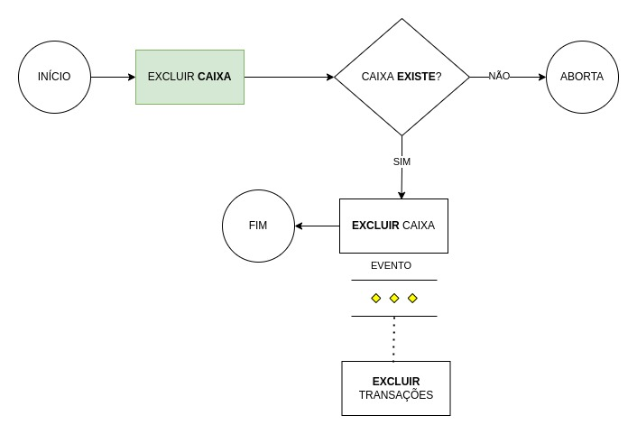

# BudgetBox - Aggregate

---

São os caixas financeiros os quais o usuário irá cadastrar e definir sua meta em percentual.
Podendo também ser categorizado como um benefício.

Caso este esteja definido como benefício o percentual não pode ser diferente de 100%.

A soma de todos os caixas cadastrados e definidos como percentual não pode ultrapassar 100%.
bem como nenhum caixa percentual individual não pode ter a meta superior a 100%.

Cada caixa possui motivos que são pertinentes apenas a ele mesmo.

Os motivos tem como objetivo identificar a finalidade do lançamento.

A cada lançamento de entrada este receberá o montante de acordo com o percentual definido:

exemplo:

- Lançamento: Entrada;
- Valor: R$ 100;
- Percentual definido no caixa: 80;
- Montante a ser creditado no caixa: 80;

```json
{
  "id": "uuid",
  "owner-id": "uuid",
  "description": "valid_description",
  "balance-available": 1000,
  "is-percentual": true,
  "budget-percentage": 80,
  "reasons": [
    {
      "id": "uuid",
      "description": "valid_descripíont"
    }
  ]
}
```

### Structure

- Budgetbox: Aggregate - Ok
- reason-description: Value Object - Ok
- budget-description: Value Object - Ok
- budget-id: Value Object - Ok
- budget-percentage: Value Object - Ok
- reason: Entity - Ok
- reason-id: Value Object - Ok

## Fluxos
#### Excluir um caixa financeiro


