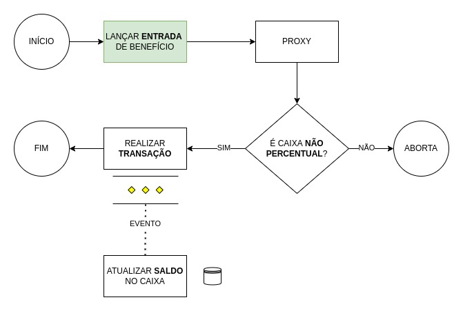
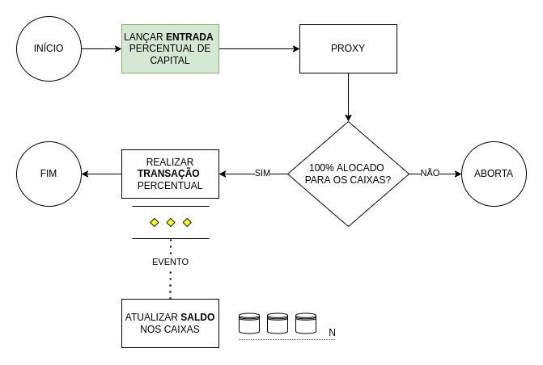
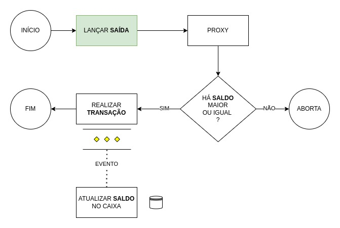
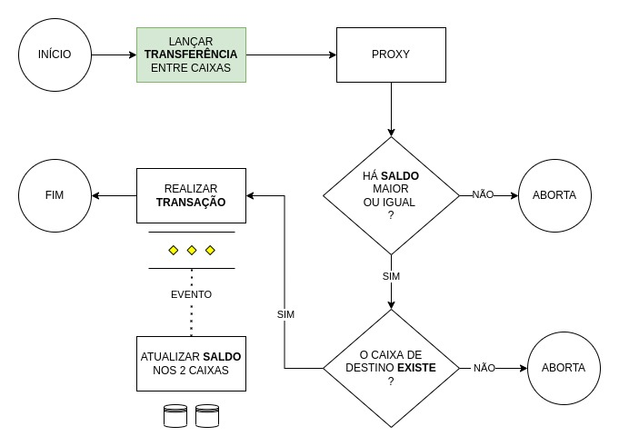

# Transaction - Aggregate

---

Este agregado identifica cada lançamento do usuário, seja entrada ou saída.
O total deve ser a soma dos valores de cada item na lista de calculos da transação.
Só pode haver dois tipos de lançamento: "Entrada" ou "Saida".

```json
{
  "user-id": "uuid",
  "reason": "valid_reason",
  "payment-date": "2021-01-01 10:00:00",
  "transaction-type": "Entrada | Saida",
  "status": "Pendente | Concluído | Estornado",
  "note": "valid_description",
  "attachment": "url",
  "total-value": {
    "value": 100,
    "currency": "BRL"
  },
  "transaction-calculations": [
    {
      "budgetBoxName": "valid_name",
      "budgetbox-id": "uuid",
      "Value": 50
    },
    {
      "budgetBoxName": "valid_name",
      "budgetbox-id": "uuid",
      "Value": 50
    }
  ]
}
```

- transaction-type: Value Object (enum) - Ok
- status: Value Object (enum) - Ok
- note: Value Object - Ok
- attachment-path: Value Object - Ok
- transaction-calculations: Value Object - Ok
- payment-date: Value Object - Ok
- budgetBoxName: Value Object - Ok
- reason: Value Object - Ok

### Fluxo de transações

#### Realizar um lançamento de entrada em um caixa de benefício



#### Realizar um lançamento de entrada distribuido para todos os caixas que estão marcados como percentual



#### Realizar um lançamento de saída (despesa) em algum caixa



#### Realizar um lançamento de transferência de saldo entre caixas

