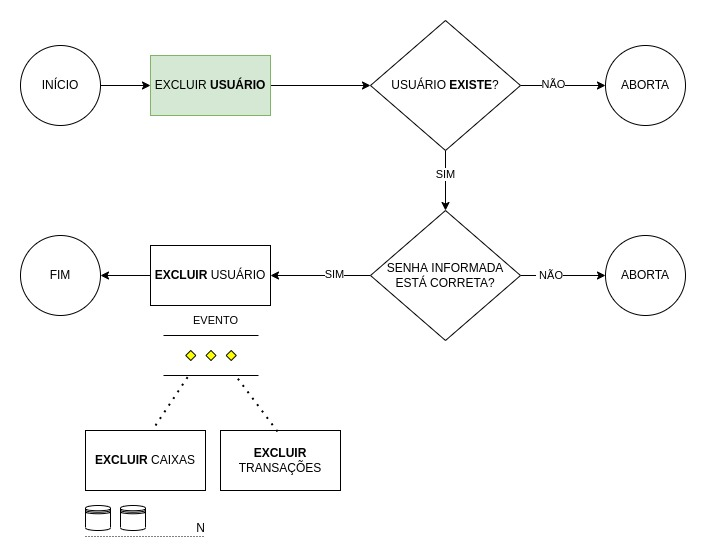

# User - Aggregate

---

Este agregado identifica cada indivíduo cadastrado na plataforma, 
bem como controla o acesso e define o proprietário de cada registro.

```json
{
  "id": "uuid",
  "email": "valid_email@domain.com",
  "password": "valid_password",
  "createdAt": "2021-01-01 10:00:00",
  "updatedAt": "2021-01-01 10:00:00",
  "deletedAt": "",
  "terms": [
    {
      "ip": "127.0.0.1",
      "acceptedAt": "2021-01-01 10:00:00",
      "userAgent": {
        "name": "firefox",
        "version": "86.0",
        "os": "windows",
        "type": "browser",
      }
    },
  ]
}
```

- email: Value Object - Ok
- password: Value Object - Ok
- terms: Value Object - Ok
- ip: Value Object - Ok

### Fluxos

#### Excluir uma conta de usuário


